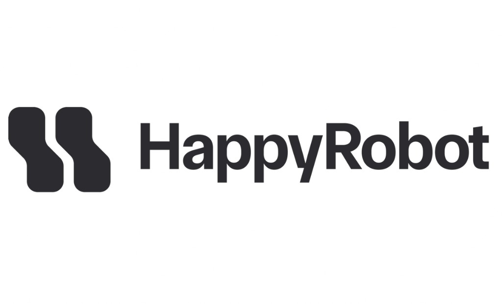

<p align="center">
  
</p>

<h1 align="center">Inbound Carrier Sales — FDE Technical Challenge</h1>

<p align="center"><strong>HappyRobot</strong> voice platform · FastAPI backend · Live operations dashboard</p>

<p align="center"><em>AI-powered inbound carrier sales for Acme Logistics: MC verification (FMCSA), load search, negotiation, post-call logging, and analytics.</em></p>

---

## Architecture

```
┌─────────────────────────────────────────────────────┐
│                  HappyRobot Platform                │
│  ┌──────────┐  ┌──────────┐  ┌────────────────┐   │
│  │ Web Call  │→ │  Voice   │→ │  Post-Call      │   │
│  │ Trigger  │  │  Agent   │  │  AI Extract +   │   │
│  └──────────┘  │  + Tools │  │  AI Classify    │   │
│                └────┬─────┘  └───────┬────────┘   │
│                     │                │             │
└─────────────────────┼────────────────┼─────────────┘
                      │                │
             ┌────────▼────────────────▼──────┐
             │   FastAPI API (e.g. Railway)    │
             │  /api/carrier/verify → FMCSA    │
             │  /api/loads/search → SQLite     │
             │  /api/negotiate → rate engine   │
             │  /api/calls/log → call logger   │
             │  /api/metrics → dashboard data  │
             │  /api/intelligence/carriers     │
             │  /dashboard → ops UI (key inj.) │
             └────────────────────────────────┘
```

*Local web voice testing (optional):* run `server/` (token API, port 3001) and `client/` (Vite); see **Optional: local web voice client** below.

## Tech Stack

- **Runtime:** Python 3.12
- **Framework:** FastAPI + Uvicorn
- **Database:** SQLite (`DB_PATH`, default `data/carrier_sales.db`)
- **Dashboard:** Static HTML + Chart.js (Inter & JetBrains Mono); `API_KEY` injected when serving `/dashboard`
- **Voice test UI (local):** React + Vite (`client/`), token helper Express (`server/`, port 3001) + HappyRobot SDK
- **Deployment:** Docker / Docker Compose, Railway
- **External APIs:** FMCSA (official + VerifyCarrier fallback)

---

## Local Setup

```bash
# Clone the repository
git clone https://github.com/piercegf/happy-robot-fde.git
cd happy-robot-fde

# Create virtual environment
python -m venv venv
source venv/bin/activate  # On Windows: venv\Scripts\activate

# Install dependencies
pip install -r requirements.txt

# Configure environment
cp .env.example .env
# Edit .env with your FMCSA web key (optional)

# Create data directory
mkdir -p data

# Start the server
uvicorn app.main:app --reload --port 8000
```

The API is now running at `http://localhost:8000` and the dashboard at `http://localhost:8000/dashboard` (always use this URL so the API key is injected—do not open `dashboard/index.html` as a file).

### Optional: local web voice client

To place test calls from the browser against your HappyRobot workflow (separate from Railway):

1. **`server/`** — copy `server/.env.example` → `server/.env`, set `HAPPYROBOT_API_KEY`, `WORKFLOW_ID`, and `HAPPYROBOT_ENVIRONMENT` (`production` if the workflow is only published to prod). Run `npm install && npm run dev` (default port **3001**).
2. **`client/`** — `npm install && npm run dev`. Vite proxies `/api/voice` to the token server. Use the printed localhost URL (5173, 5174, …).

### Seed Test Data

```bash
python scripts/seed_calls.py --url http://localhost:8000 --api-key acme-logistics-2026
```

This inserts 28 realistic test calls with a distribution of booked, rejected, no_match, callback, and not_authorized outcomes.

---

## Docker Setup

```bash
docker-compose up --build
```

The service starts on port 8000 with a persistent `data/` volume for the SQLite database.

---

## Railway Deployment

1. Push this repository to GitHub
2. Connect the repo to [Railway](https://railway.app)
3. Set environment variables: `API_KEY`, `FMCSA_WEBKEY` (optional), and optionally `DB_PATH` if you use a volume path
4. Railway auto-detects the Dockerfile and deploys

The `railway.json` config handles build and start command settings.

---

## API Documentation

All endpoints require the `X-API-Key` header (default: `acme-logistics-2026`).

### `GET /health`

Health check — no auth required.

```json
{
  "status": "ok",
  "timestamp": "2026-03-30T12:00:00+00:00",
  "version": "1.0.0"
}
```

### `GET /api/carrier/verify/{mc_number}`

Verify a carrier's FMCSA authority.

```bash
curl -H "X-API-Key: acme-logistics-2026" http://localhost:8000/api/carrier/verify/120500
```

```json
{
  "mc_number": "120500",
  "legal_name": "Swift Transportation Co",
  "allowed_to_operate": "Y",
  "is_eligible": true,
  "carrier_operation": "Interstate",
  "safety_rating": "Satisfactory",
  "total_power_units": 18340,
  "total_drivers": 21500,
  "source": "FMCSA"
}
```

### `POST /api/loads/search`

Search available loads by origin, destination, and/or equipment type. All fields are optional; matching is fuzzy (LIKE).

```bash
curl -X POST http://localhost:8000/api/loads/search \
  -H "X-API-Key: acme-logistics-2026" \
  -H "Content-Type: application/json" \
  -d '{"origin": "Chicago", "equipment_type": "Dry Van"}'
```

```json
{
  "loads": [
    {
      "load_id": "LD-1001",
      "origin": "Chicago, IL",
      "destination": "Dallas, TX",
      "equipment_type": "Dry Van",
      "loadboard_rate": 2850.0,
      "miles": 920,
      "weight": 38000,
      "pickup_datetime": "2026-04-02T08:00",
      "delivery_datetime": "2026-04-03T18:00",
      "commodity_type": "Consumer Electronics",
      "notes": "Dock-to-dock. No touch freight."
    }
  ],
  "count": 1
}
```

### `GET /api/loads/{load_id}`

Get a single load by ID.

```bash
curl -H "X-API-Key: acme-logistics-2026" http://localhost:8000/api/loads/LD-1001
```

### `POST /api/negotiate`

Negotiate a rate on a load. Supports up to 3 rounds. Floor is 95% of loadboard rate.

```bash
curl -X POST http://localhost:8000/api/negotiate \
  -H "X-API-Key: acme-logistics-2026" \
  -H "Content-Type: application/json" \
  -d '{"load_id": "LD-1001", "offered_rate": 2600, "round_number": 1}'
```

```json
{
  "accepted": false,
  "counter_offer": 2850.0,
  "message": "I appreciate the offer, but the posted rate for this Chicago, IL to Dallas, TX lane is $2,850. That's where we need to be to cover this load.",
  "final": false
}
```

### `POST /api/calls/log`

Log a completed call. `call_id` and `timestamp` are auto-generated if omitted. If your workflow sends `sentiment_classifier` instead of `sentiment`, the API maps it into `sentiment`. Omit `call_duration_seconds` when unknown (stored as SQL `NULL`, not zero).

```bash
curl -X POST http://localhost:8000/api/calls/log \
  -H "X-API-Key: acme-logistics-2026" \
  -H "Content-Type: application/json" \
  -d '{
    "carrier_mc": "MC-120500",
    "carrier_name": "Swift Transportation",
    "requested_origin": "Chicago, IL",
    "requested_destination": "Dallas, TX",
    "equipment_type": "Dry Van",
    "load_id_matched": "LD-1001",
    "loadboard_rate": 2850.0,
    "agreed_rate": 2780.0,
    "negotiation_rounds": 2,
    "outcome": "load_booked",
    "sentiment": "positive",
    "call_duration_seconds": 245,
    "counter_offers": [2850, 2765.5],
    "notes": "Good call. Carrier familiar with lane."
  }'
```

```json
{
  "status": "logged",
  "call_id": "a1b2c3d4-e5f6-7890-abcd-ef1234567890"
}
```

### `GET /api/calls`

List all logged calls, most recent first.

```bash
curl -H "X-API-Key: acme-logistics-2026" http://localhost:8000/api/calls
```

### `GET /api/loads`

List all loads in the knowledge base (same data the agent searches), sorted by `load_id`.

```bash
curl -H "X-API-Key: acme-logistics-2026" http://localhost:8000/api/loads
```

### `GET /api/intelligence/carriers`

Per-carrier aggregates from call history (used by the **Contact Intelligence** dashboard tab): booking rate, revenue, dominant sentiment, top lane, etc.

```bash
curl -H "X-API-Key: acme-logistics-2026" http://localhost:8000/api/intelligence/carriers
```

### `POST /api/admin/clear-calls`

Deletes **all** rows in the `calls` table (loads unchanged). Same `X-API-Key` as other endpoints—intended for demo resets; the dashboard includes a **Clear call data** button that calls this route.

```bash
curl -X POST -H "X-API-Key: acme-logistics-2026" http://localhost:8000/api/admin/clear-calls
```

### `GET /api/metrics`

Aggregated JSON for the main dashboard: KPIs, outcome/sentiment breakdowns, funnel, charts, rate-by-lane, equipment mix, and `all_calls` for the call log (no separate `recent_calls` payload).

```bash
curl -H "X-API-Key: acme-logistics-2026" http://localhost:8000/api/metrics
```

### `GET /dashboard`

Serves the operations dashboard. The browser never needs to type a key: the server injects `API_KEY` from the environment into the page when it is rendered (the committed `dashboard/index.html` only contains a placeholder, not a real secret). Open the file via this route only—opening `index.html` directly from disk will not work. Anyone who can load `/dashboard` can still see the key in DevTools; use a strong `API_KEY` and treat the dashboard URL like an admin surface.

---

## Dashboard

Access at `http://localhost:8000/dashboard` (or your Railway URL + `/dashboard`). Set `API_KEY` in `.env` / Railway variables to match what you expect for API calls.

**Main dashboard**

- KPIs: booking rate, revenue booked, average call duration (where duration is logged), average negotiation rounds, negotiation win rate
- Revenue strip: captured vs. potential, capture rate, average discount
- Charts: call volume by day, calls by hour (24h), rate intel by lane (when booked data exists)
- **Call flow funnel** (sequential stages vs. total calls)
- Tables: outcomes, top lanes, sentiment, booked equipment mix
- Expandable **call log** with per-call details

**Other tabs**

- **Conversations** — card view of calls from `/api/calls`
- **Contact Intelligence** — `/api/intelligence/carriers` table
- **Knowledge Base** — `/api/loads` load board

**Controls**

- **Clear call data** (admin): wipes call log only; keeps loads
- Auto-refresh about every **30s** on the main dashboard; manual **refresh** in the top bar

---

## Links

- **Live Dashboard:** [https://happy-robot-fde-production-f148.up.railway.app/dashboard](https://happy-robot-fde-production-f148.up.railway.app/dashboard)
- **GitHub Repo:** [https://github.com/piercegf/happy-robot-fde](https://github.com/piercegf/happy-robot-fde)
- **HappyRobot Workflow:** [https://platform.happyrobot.ai/fdealejandroperez/workflows/gchtmr5tol1e](https://platform.happyrobot.ai/fdealejandroperez/workflows/gchtmr5tol1e)
- **Demo Video:** *(add your Loom / YouTube link here — walkthrough: workflow setup, short live demo, dashboard)*
